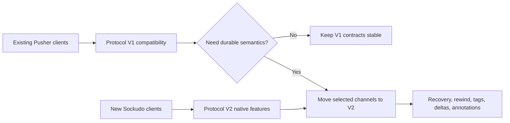

Sockudo is a Rust realtime server that exposes the Pusher Channels protocol while adding a native Sockudo protocol for features that do not fit inside the Pusher compatibility contract.

## Mental model

Sockudo has four major surfaces:

| Surface | Purpose | Where to start |
| --- | --- | --- |
| WebSocket server | Accepts client connections, subscriptions, auth results, presence transitions, and realtime events. | [First connection](/docs/getting-started/first-connection) |
| HTTP API | Lets trusted backends publish events, inspect channels, read history, mutate messages, and manage push. | [HTTP API](/docs/server/http-api) |
| Client SDKs | Browser, mobile, desktop, and .NET realtime clients that subscribe and react to events. | [Realtime Clients](/docs/clients) |
| Server SDKs | Backend libraries that sign auth responses, publish events, validate webhooks, and call REST endpoints. | [Server SDKs](/docs/server-sdks) |

## Pick your path

| You are building | Start with | You should finish with |
| --- | --- | --- |
| A Pusher replacement | [Migration](/docs/getting-started/migration) and [Protocol reference](/docs/reference/protocol) | Existing clients connecting through Protocol V1 with unchanged auth and publish semantics. |
| A new realtime product | [First connection](/docs/getting-started/first-connection) and [Authentication](/docs/getting-started/authentication) | Public, private, and presence channels wired through client and server SDKs. |
| A clustered production deployment | [Scaling](/docs/server/scaling), [Security](/docs/server/security), and [Observability](/docs/server/observability) | Load-balanced nodes, shared adapter, health probes, metrics, and dependency-specific alerts. |
| A durable collaboration or AI workflow | [Protocol V2](/docs/clients/protocol-v2), [History and recovery](/docs/server/history-recovery), and [Mutable messages](/docs/server/mutable-messages) | Serial continuity, message IDs, rewind, annotations, and safe retry behavior. |

## Protocol modes

Protocol V1 is the compatibility layer. Use it when you want existing `pusher-js`, Laravel Echo, or Pusher-shaped server SDK integrations to keep working with minimal changes.

Protocol V2 is the native layer. Use it when your application needs one or more of:

- connection recovery with `stream_id` and `serial`
- `message_id` on broadcasts
- subscribe-time rewind
- delta compression and conflation
- server-side tag filtering
- durable channel history
- versioned mutable messages
- annotations for reactions, receipts, moderation, and summaries
- push notification helper workflows

Adopt V2 by channel or client cohort. Keeping V1 clients stable while enabling V2 for new experiences is the safest migration shape.

## Channel types

Sockudo follows Pusher channel naming rules for public, private, presence, and encrypted channels.

| Channel | Prefix | Auth required | Typical use |
| --- | --- | --- | --- |
| Public | none | No | dashboards, public feeds, unauthenticated status |
| Private | `private-` | Yes | account data, order updates, team-only streams |
| Presence | `presence-` | Yes with user data | rooms, collaboration, online member lists |
| Encrypted | `private-encrypted-` | Yes with shared secret | payloads that should stay opaque to the transport |

## Production shape

A production deployment usually has:

1. One or more Sockudo nodes behind a load balancer.
2. A shared adapter such as Redis, Redis Cluster, NATS, Kafka, RabbitMQ, Pulsar, Google Pub/Sub, or Iggy.
3. A persistent app manager such as PostgreSQL, MySQL, DynamoDB, ScyllaDB, SurrealDB, or Redis when apps are not configured statically.
4. A cache and queue backend for rate limits, idempotency, webhooks, and optional push workflows.
5. Prometheus scraping and alerting for connection, fanout, push, history, and adapter health.

## What to read next

<Cards>
  <Card title="Install Sockudo" href="/docs/getting-started/installation" description="Docker, Cargo, feature flags, and local configuration." />
  <Card title="Connect a client" href="/docs/getting-started/first-connection" description="Subscribe to a channel and publish from a backend." />
  <Card title="Add authentication" href="/docs/getting-started/authentication" description="Private, presence, encrypted, and user authentication." />
  <Card title="Migrate from Pusher" href="/docs/getting-started/migration" description="Compatibility notes and cutover strategy." />
</Cards>
