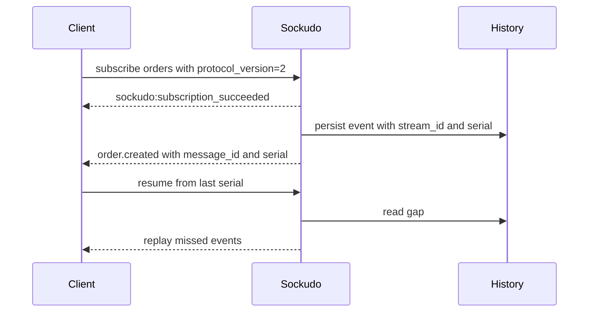

Sockudo exposes two protocol layers on the same server.

## Protocol V1

Protocol V1 is Pusher-compatible. It preserves familiar event prefixes, channel names, subscription flows, auth response shapes, and HTTP API semantics.

Use V1 for:

- existing `pusher-js` clients
- Laravel Echo migrations
- backend SDK compatibility
- minimal drop-in deployments

Typical V1 connection and event frames keep the Pusher names and payload conventions:

```json
{
  "event": "pusher:connection_established",
  "data": "{\"socket_id\":\"123.456\",\"activity_timeout\":120}"
}
```

```json
{
  "event": "order.created",
  "channel": "orders",
  "data": "{\"id\":\"ord_123\",\"total\":4200}"
}
```

Keep V1 payloads compatible with existing clients. Do not require V2-only fields such as `message_id`, `serial`, `stream_id`, tags, deltas, or annotation metadata when the recipient negotiated V1.

## Protocol V2

Protocol V2 is Sockudo-native and uses `sockudo:` system event prefixes.

Use V2 for:

- `message_id`
- `serial`
- `stream_id`
- connection recovery
- subscribe-time rewind
- delta compression
- tag filtering
- durable history
- mutable messages
- annotations
- push-helper client workflows through backend proxies

V2 keeps the event/channel shape familiar, then adds metadata required for continuity and durable workflows:

```json
{
  "event": "order.created",
  "channel": "orders",
  "data": { "id": "ord_123", "total": 4200 },
  "message_id": "msg_01HX6J2P5N0Z9E",
  "stream_id": "orders",
  "serial": 42,
  "extras": {
    "headers": { "tenant": "acme" },
    "tags": { "status": "paid", "region": "eu" }
  }
}
```

Use V2 when the client needs to reconnect without guessing what it missed, rewind a subscription from known history, filter by tags, receive deltas, or render mutable message state.



## Prefixes

| Event family | V1 | V2 |
| --- | --- | --- |
| Public system events | `pusher:` | `sockudo:` |
| Internal events | `pusher_internal:` | `sockudo_internal:` |
| Mutable messages | not available | `sockudo:message.*` |
| Recovery | not available | `sockudo:resume_*` |
| Rewind | not available | `sockudo:rewind_complete` |

## Channel names

| Channel | Prefix |
| --- | --- |
| Public | none |
| Private | `private-` |
| Presence | `presence-` |
| Encrypted | `private-encrypted-` |

## Broadcast metadata

```json
{
  "event": "order.updated",
  "channel": "orders",
  "data": { "id": "ord_123" },
  "message_id": "msg_01HX",
  "stream_id": "orders",
  "serial": 42,
  "extras": {
    "headers": { "tenant": "acme" },
    "tags": { "status": "packed" }
  }
}
```

V1 clients should not depend on V2-only fields.

## Compatibility boundary

The compatibility rule is simple: negotiate the richest protocol a client can safely understand, then deliver only fields that belong to that protocol.

| Concern | V1 behavior | V2 behavior |
| --- | --- | --- |
| System prefixes | `pusher:` and `pusher_internal:` | `sockudo:` and `sockudo_internal:` |
| Event metadata | Pusher-compatible event, channel, and data | Adds serials, message IDs, stream IDs, extras, tags, and headers where enabled. |
| Recovery | Client reconnects and resubscribes | Client can resume from continuity metadata when recovery is configured. |
| Mutable messages | Not exposed | Message updates, deletes, appends, versions, and annotations are explicit V2 events. |
| Server publish | Pusher-shaped HTTP API | Same trusted API plus V2 acknowledgement fields when enabled. |

For mixed deployments, treat Protocol V1 as a stable contract and Protocol V2 as an opt-in capability layer. A backend may publish once, but Sockudo must shape the delivery for each subscriber according to the subscriber protocol.

## Push is outside the WebSocket protocol

Push notifications are HTTP-driven. They target device registrations, channel push subscriptions, clients, or explicit recipients. A push payload may reference a realtime channel or message serial, but provider delivery is not part of WebSocket ordering.
