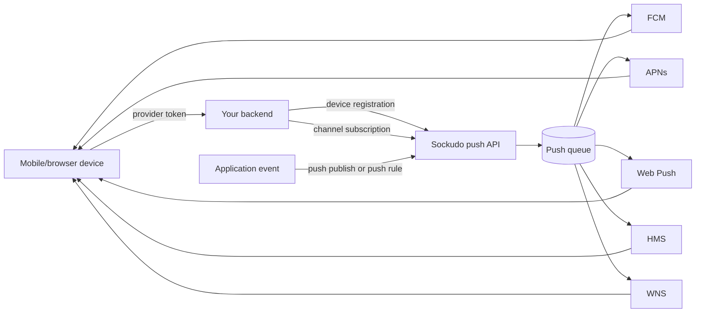
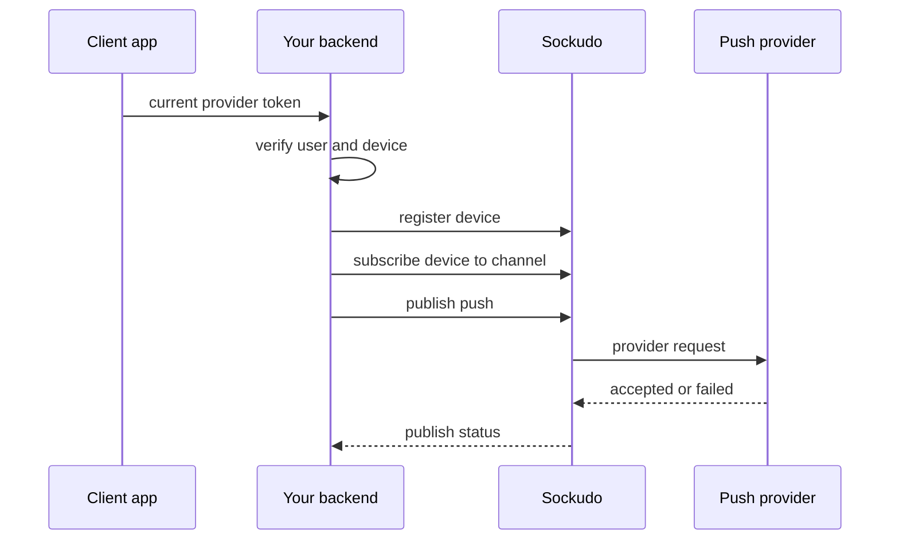

Push notifications are a core part of Sockudo. WebSockets deliver realtime messages to connected clients; push notifications reach devices that are offline, backgrounded, rate-limited by the OS, or outside the active channel session.



## Concepts

| Concept | Meaning |
| --- | --- |
| Device registration | A device record tied to a provider token and optional `client_id`. |
| Activation | A safe workflow for clients to register or update devices through your backend. |
| Channel subscription | A mapping between a device and a realtime channel for push targeting. |
| Credential | Provider configuration for FCM, APNs, Web Push, HMS, or WNS. |
| Publish | A push request accepted by Sockudo and fanned out asynchronously. |
| Publish status | The operational record for accepted, scheduled, dispatched, failed, or cancelled push work. |

## Provider support

| Provider | Platforms | Credentials | Notes |
| --- | --- | --- | --- |
| FCM | Android, web, cross-platform app backends | Service account JSON and optional project ID | Best default for Android and Firebase-backed apps. |
| APNs | iOS, iPadOS, macOS, watchOS, tvOS, visionOS | Team ID, key ID, bundle ID, `.p8` private key, environment | Use sandbox for development tokens and production for App Store/TestFlight tokens. |
| Web Push | Browsers and installed PWAs | VAPID subject, public key, private key | Payload size and browser support vary; store endpoint metadata with the device. |
| HMS | Huawei devices | App credentials | Use when shipping to Huawei Mobile Services environments. |
| WNS | Windows apps | WNS credentials | Use for Microsoft Store/Windows notification channels. |

Sockudo normalizes admission, idempotency, queueing, retries, status retention, and feedback. Provider-specific limits still apply after the request leaves Sockudo.

## Configure providers

```toml
[push]
enabled = true
async_only = true
default_ttl_seconds = 3600
publish_status_ttl_seconds = 86400
max_recipients_per_publish = 10000

# Runtime env for FCM monolith workers:
# PUSH_FCM_ENABLED=true
# PUSH_FCM_SERVICE_ACCOUNT_JSON_PATH=/run/secrets/fcm-service-account.json
# PUSH_FCM_PROJECT_ID is optional when the service account JSON has project_id.

[push.providers.apns]
enabled = true
environment = "production"
team_id = "TEAMID1234"
key_id = "KEYID12345"
bundle_id = "com.example.app"
private_key_path = "/run/secrets/AuthKey_KEYID12345.p8"

[push.providers.webpush]
enabled = true
vapid_subject = "mailto:ops@example.com"
vapid_public_key = "${WEB_PUSH_PUBLIC_KEY}"
vapid_private_key = "${WEB_PUSH_PRIVATE_KEY}"

[push.providers.hms]
enabled = true
app_id = "${HMS_APP_ID}"
app_secret = "${HMS_APP_SECRET}"

[push.providers.wns]
enabled = true
package_sid = "${WNS_PACKAGE_SID}"
client_secret = "${WNS_CLIENT_SECRET}"
```

## Register devices

Clients should call your backend. Your backend authenticates the user, validates ownership, and forwards to Sockudo with server credentials.

```ts
app.post("/api/push/devices", async (req, res) => {
  const user = requireUser(req);

  const result = await sockudo.activateDevice({
    device_id: req.body.device_id,
    client_id: user.id,
    platform: req.body.platform,
    provider_token: req.body.provider_token,
  });

  res.json(result);
});
```

Device IDs should be stable per installation. Provider tokens can rotate; update the registration
when the platform SDK gives you a new token.

## Subscribe devices to channels

```ts
await sockudo.upsertChannelPushSubscription({
  device_id: "ios-device-1",
  client_id: "user-42",
  channel: "orders",
});
```

Use the same authorization model as realtime channel subscription. If the user cannot subscribe to `private-orders` over WebSocket, they should not subscribe a device to `private-orders` for push.



## Publish

```ts
const response = await sockudo.publishPush({
  recipients: [
    { type: "channel", channel: "orders" },
    { type: "client", client_id: "user-42" },
  ],
  payload: {
    title: "Order updated",
    body: "Order ord_123 is packed",
    data: {
      order_id: "ord_123",
      channel: "orders",
    },
  },
  idempotency_key: "push-order-ord_123-packed",
  sync: false,
});

console.log(response.publish_id);
```

Use `sync: false` for most production traffic. Async admission returns quickly, then workers fan out
to providers and update publish status records.

## Schedule and cancel

```ts
const scheduled = await sockudo.schedulePush({
  run_at: "2026-05-19T18:00:00Z",
  recipients: [{ type: "client", client_id: "user-42" }],
  payload: { title: "Reminder", body: "Your room starts soon" },
});

await sockudo.cancelScheduledPush(scheduled.publish_id);
```

## Channel-triggered push rule

Push rules convert normal channel events into push work. This is useful for product events and AI
agent completion notifications.

```toml
[[push_rules]]
enabled = true
channel_pattern = "notifications:*"
event_filter = ["agent-complete", "order-ready"]
rate_limit_per_second = 100

[push_rules.payload_mapping]
title_field = "title"
body_field = "body"
template_data_field = "data"
include_remaining_fields = true
```

```json
{
  "name": "agent-complete",
  "channel": "notifications:user-42",
  "data": {
    "title": "Agent finished",
    "body": "Your answer is ready",
    "data": {
      "session_id": "sess_01J"
    }
  }
}
```

## Capacity planning

Push fanout has a different bottleneck profile than WebSocket fanout:

- provider rate limits
- token invalidation churn
- per-platform payload size limits
- queue depth and worker concurrency
- status retention writes
- scheduled publish scans
- provider callback volume

Before a campaign, test admission and provider dispatch separately. A healthy API admission rate does not prove provider delivery capacity.

## Benchmarking

Use the repository push scripts for repeatable scenarios:

```bash
node scripts/push-benchmark.mjs \
  --host http://127.0.0.1:6001 \
  --app-id app-id \
  --key app-key \
  --secret app-secret \
  --devices 10000 \
  --channels orders \
  --publish-rate 100
```

Track accepted publishes, queue depth, provider dispatch latency, provider error classes, and status write latency.

## Troubleshooting

| Symptom | Check |
| --- | --- |
| `202` returned but no notification | Inspect publish status and provider errors. |
| APNs rejects token | Verify bundle ID, environment, topic, and token freshness. |
| Web Push rejected | Verify VAPID subject and key pair. |
| FCM unauthorized | Verify service account and project. |
| Channel push misses users | Verify channel push subscriptions and `client_id` mapping. |
| Large push is rejected | Check platform payload limits and remove nonessential data. |

Push payloads should wake the app and include stable IDs. Fetch authoritative application state after the user opens the notification.
