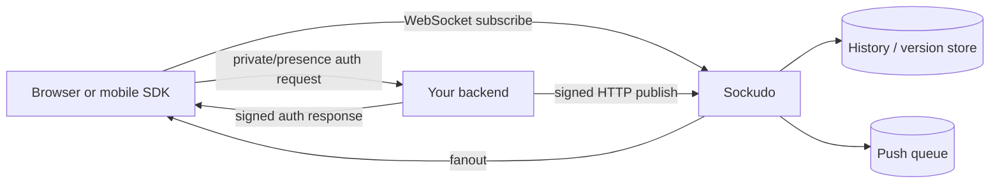
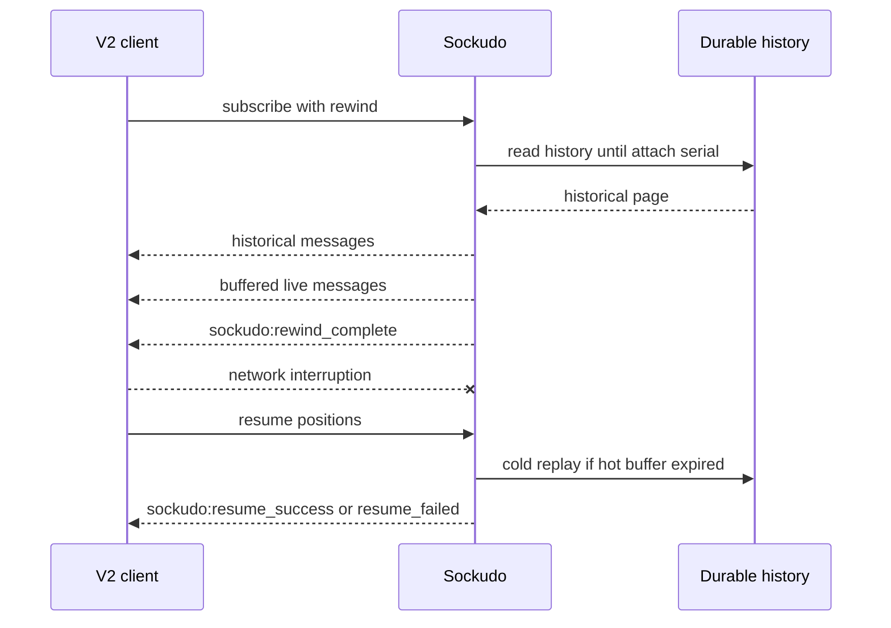
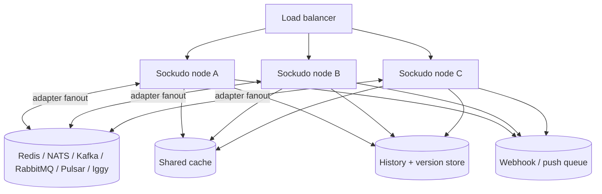

Sockudo starts Pusher-compatible and becomes Sockudo-native when you opt into Protocol V2 features.
The safest production pattern is to keep untrusted clients simple and put authority in your backend.



## Public feed

Public channels require no channel auth. Use them for data that is safe for anyone with the app key
to receive.

```ts
import Sockudo from "@sockudo/client";

const client = new Sockudo("app-key", {
  wsHost: "realtime.example.com",
  forceTLS: true,
});

const channel = client.subscribe("market:btc");
channel.bind("price.updated", (event) => {
  renderPrice(event.data);
});
```

Publish from a trusted backend:

```ts
await sockudo.trigger("market:btc", "price.updated", {
  symbol: "BTC",
  price: "104200.00",
});
```

## Private channel

Private channels prove the user can subscribe before Sockudo admits the connection.

```ts
const client = new Sockudo("app-key", {
  wsHost: "realtime.example.com",
  forceTLS: true,
  channelAuthorization: {
    endpoint: "/api/sockudo/channel-auth",
    headers: { "x-csrf": csrfToken },
  },
});

const account = client.subscribe("private-account:user-42");
account.bind("invoice.paid", updateInvoice);
```

Backend auth should derive the channel from verified user state, not from a trusted-looking request
body.

```ts
app.post("/api/sockudo/channel-auth", async (req, res) => {
  const user = requireUser(req);
  const { socket_id, channel_name } = req.body;

  if (channel_name !== `private-account:${user.id}`) {
    return res.status(403).json({ error: "forbidden" });
  }

  res.json(sockudo.authorizeChannel(socket_id, channel_name));
});
```

## Presence room

Presence channels add a current member list and join/leave events.

```ts
const room = client.subscribe("presence-room:incident-123");

room.bind("pusher:subscription_succeeded", (members) => {
  renderMembers(members);
});

room.bind("pusher:member_added", (member) => {
  addMember(member.id, member.info);
});

room.bind("pusher:member_removed", (member) => {
  removeMember(member.id);
});
```

Presence auth includes user data:

```ts
res.json(sockudo.authorizeChannel(socketId, channelName, {
  user_id: user.id,
  user_info: {
    name: user.name,
    role: user.role,
  },
}));
```

## Protocol V2 recovery and rewind

Protocol V2 clients can recover missed messages and ask for recent history during subscribe.

```ts
const client = new Sockudo("app-key", {
  wsHost: "realtime.example.com",
  forceTLS: true,
  protocolVersion: 2,
  connectionRecovery: true,
});

const orders = client.subscribe("private-orders:user-42", {
  rewind: { count: 50 },
});

orders.bind("sockudo:rewind_complete", ({ historical_count, live_count }) => {
  console.log({ historical_count, live_count });
});

client.bind("sockudo:resume_success", ({ recovered, failed }) => {
  console.log("resume", { recovered, failed });
});
```



Use `until_attach` for late joins: it prevents a history page from racing with live messages above
the attach serial.

## Mutable messages

Mutable messages let a logical message be updated, deleted, appended, and summarized while keeping a
version history.

```ts
const latest = await channel.getMessage("msg_01J");

const versions = await channel.getMessageVersions("msg_01J", {
  limit: 20,
  direction: "oldest_first",
});
```

Trusted backends mutate through signed HTTP:

```http
POST /apps/{app_id}/channels/private-doc:123/messages/msg_01J/update
Content-Type: application/json
```

```json
{
  "data": { "title": "Final incident report" },
  "description": "user edit",
  "metadata": { "editor": "user-42" },
  "op_id": "edit-msg_01J-title-v2"
}
```

Append is the right primitive for streams:

```json
{
  "data": "next generated token ",
  "extras": {
    "ai": {
      "transport": {
        "turn-id": "turn_123",
        "stream-id": "text",
        "status": "streaming"
      }
    }
  },
  "op_id": "turn_123:text:00042"
}
```

## Annotations

Annotations attach secondary state to a message without rewriting the message itself. Use them for
reactions, read receipts, moderation notes, delivery receipts, and summaries.

```http
POST /apps/{app_id}/channels/chat/messages/msg_01J/annotations
Content-Type: application/json
```

```json
{
  "type": "reactions:distinct.v1",
  "name": "thumbs-up",
  "client_id": "user-42",
  "count": 1
}
```

## Backend publishing checklist

| Concern | Recommendation |
| --- | --- |
| Secrets | Keep app secrets and provider credentials server-side. |
| Idempotency | Send `idempotency_key` for business events and `op_id` for mutations. |
| Echo | Use `socket_id` when the originating client already applied an optimistic update. |
| Payload size | Send stable identifiers and fetch large state from your app API. |
| Auth | Sign private, presence, encrypted, and user auth from your backend. |
| History | Store opaque cursors unchanged. Do not parse cursor internals. |

## Scaling shape



For horizontal deployments, avoid memory-only cache, queue, history, and version stores. Memory is
fine for local development and single-node demos; production clusters need shared stores for
idempotency, recovery, push dispatch, and durable history continuity.

## Normal Sockudo vs AI Transport

| Need | Normal Sockudo | AI Transport |
| --- | --- | --- |
| Broadcast app events | `trigger`, channels, private auth | Not needed |
| Presence/collaboration | Presence channels | Used for agent/user state too |
| Recover after reconnect | Protocol V2 recovery | Required for durable turns |
| Persist channel history | Durable history | Required for sessions |
| Edit or append messages | Mutable messages | Used for streamed output |
| Wake offline users | Push notifications | Used for background agents |
| Model/provider integration | Your app code | Provider adapters and turn lifecycle |

Start with normal Sockudo when you are building realtime product events. Add AI Transport when model
turns need to outlive one HTTP request, one browser tab, or one device.

